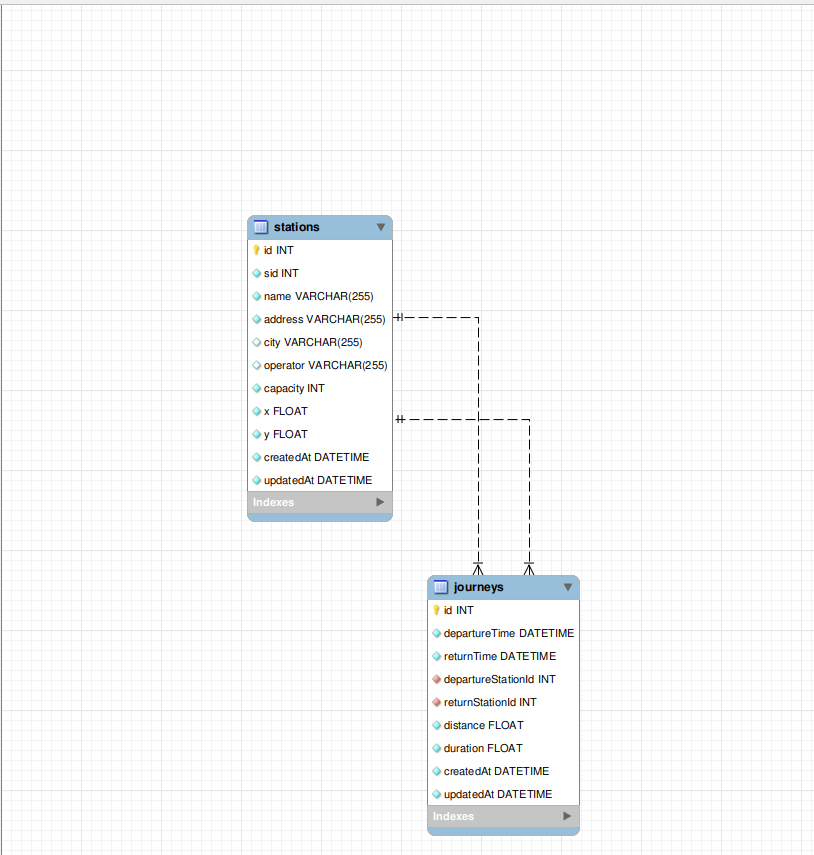
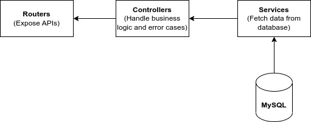

# Helsinki City Bike App
This project implements an application for displaying HSL city bike stations and journeys in the Helsinki capital area. 

## Get started 
The project consists of two parts: 
* a backend service: this repo, implemented using [Koa2](https://koajs.com/)
* UI: in [another repo](https://github.com/yumoL/helsinki_city_bike_app_frontend): implemented using [React](https://react.dev/)

### For users
Start the App by running
```bash
# under this repo root
docker compose up
```
The UI runs at http://localhost:3000 and backend service http://localhost:3001. You can either upload station and journey CSV files using the UI or running ```npm run init_data```. Running the command will upload the station CSV file and the journey CSV files of May and June. 

Clean up
```bash
#under this repo root
docker compose down
```
### For developers
1. Start a MySql server
```bash
# under this repo root
docker compose -f docker-compose.dev.yaml
```
2. Initialize the schemas in the databases:
```bash
# development database
npm run init_db

# testing database
npm run init_test_db
```
3. Start the backend
```bash
# under this repo root
npm install #only needed for the first time
npm run dev
```
4. Start the UI
```bash
# under the UI repo root
npm install #only needed for the first time
npm start
```
5. Test the backend
```bash
# under this repo root
npm run test
```
6. Building docker images
```bash
# backend, under this repo root
docker build -t docker push docker.io/<your-dockerhub-username>/hsl-city-bike-backend:v1 .
docker push docker.io/<your-dockerhub-username>/hsl-city-bike-backend:v1

# frontend, under the UI repo root
docker build -t docker push docker.io/<your-dockerhub-username>/hsl-city-bike-frontend:v1 .
docker push docker.io/<your-dockerhub-username>/hsl-city-bike-frontend:v1
```
**Note**: Remember to also change the backend and UI docker image names in docker-compose.yaml. 

## More info
* The **implemented features** are documented and demonstrated [here](./docs/features.md).
* The database schemas are shown below:


Specifically, Each `Station` has many `Journeys`. `Journeys` are associated with `Stations` by two foreign keys `departureStationId` and `returnStationId`, which reference `sid` in the `Station` model. 
* The implementation logic of the backend service can be illustrated by the following figure: 

